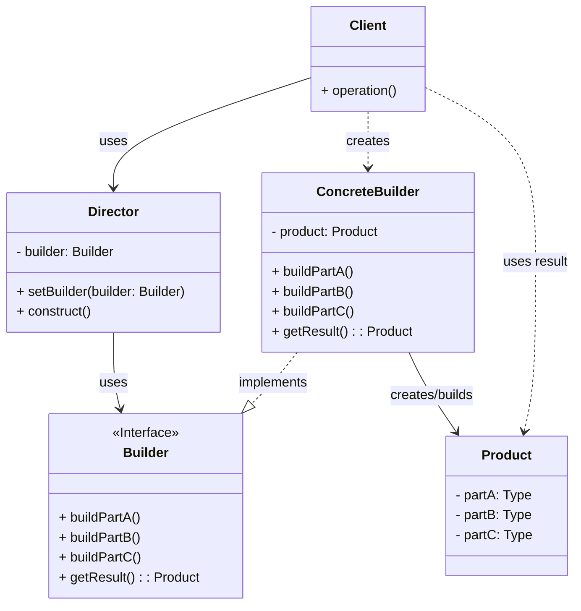

# Builder Pattern Recipe

The Builder pattern is a creational design pattern that lets you construct complex objects step by step. The pattern allows you to produce different types and representations of an object using the same construction code.

## Intent

Separate the construction of a complex object from its representation so that the same construction process can create different representations.

## Structure (MermaidJS)

## Explanation

*   **Builder**: Specifies an abstract interface for creating parts of a `Product` object.
*   **ConcreteBuilder**: Constructs and assembles parts of the product by implementing the `Builder` interface. Defines and keeps track of the representation it creates and provides an interface for retrieving the product.
*   **Product**: Represents the complex object under construction. Contains many parts and might require extensive configuration.
*   **Director**: Constructs an object using the `Builder` interface. The `Director` orchestrates the construction process using a specific sequence of builder method calls.
*   **Client**: Creates a `ConcreteBuilder` object, optionally passes it to the `Director`, and retrieves the final product.

## When to Use

* When the algorithm for creating a complex object should be independent of the parts that make up the object and how they're assembled
* When the construction process must allow different representations for the object that's constructed
* When you need to isolate complex construction code from the business logic of the product

## Benefits

* Allows you to construct objects step-by-step, defer construction steps, or run steps recursively
* Lets you vary a product's internal representation
* Isolates code for construction and representation
* Provides greater control over the construction process
