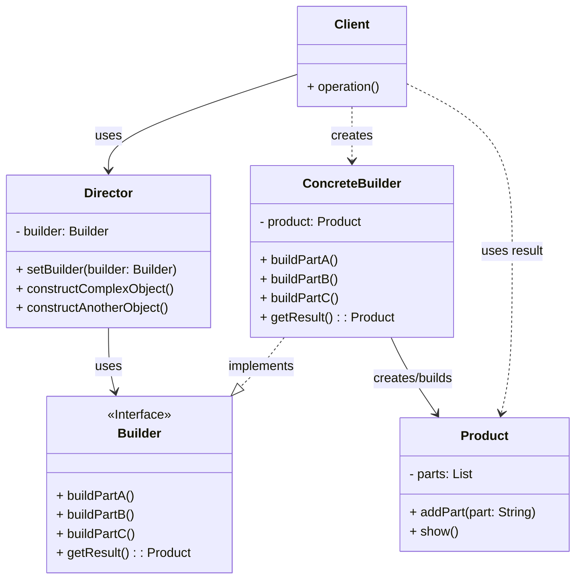

# Builder Pattern Recipe

The Builder pattern is a creational design pattern that lets you construct complex objects step by step. The pattern allows you to produce different types and representations of an object using the same construction code.

## Intent

Separate the construction of a complex object from its representation so that the same construction process can create different representations.

## Structure (MermaidJS)

## Explanation

*   **Builder**: Specifies an abstract interface for creating parts of a `Product` object.
*   **ConcreteBuilder**: Constructs and assembles parts of the product by implementing the `Builder` interface. It defines and keeps track of the representation it creates and provides an interface for retrieving the product (`getResult`).
*   **Product**: Represents the complex object under construction. `ConcreteBuilder` builds the product's internal representation and defines the process by which it's assembled. Includes classes that define the constituent parts, including interfaces for assembling the parts into the final result.
*   **Director**: Constructs an object using the `Builder` interface. The `Director` is not responsible for creating the parts, but for orchestrating the construction process using a specific sequence of calls to the `Builder`.
*   **Client**: Creates a `ConcreteBuilder` object and passes it to the `Director`. Can also retrieve the final `Product` from the `Builder`.
 checkout 
This pattern is particularly useful when an object needs to be created with many configuration options or parts. It encapsulates the way a complex object is constructed, allowing the construction process to be varied independently. It improves readability and maintainability by isolating complex construction logic. 