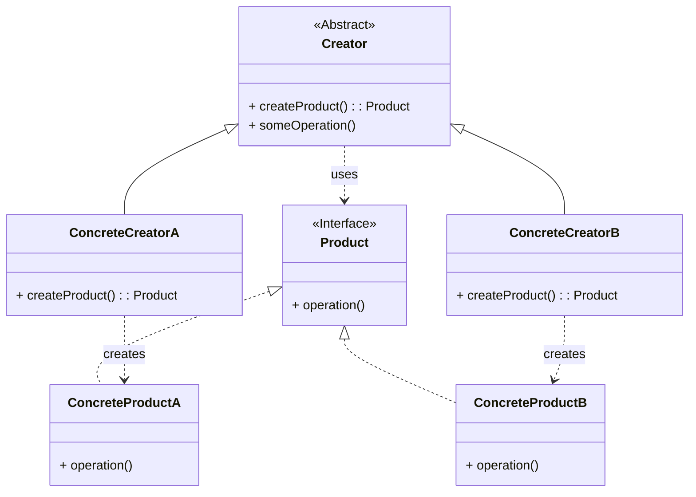

# Factory Method Pattern Recipe

The Factory Method pattern is a creational design pattern that provides an interface for creating objects in a superclass, but allows subclasses to alter the type of objects that will be created.

## Intent

Define an interface for creating an object, but let subclasses decide which class to instantiate. Factory Method lets a class defer instantiation to subclasses.

## Structure (MermaidJS)

## Explanation

*   **Product**: Defines the interface of objects the factory method creates.
*   **ConcreteProduct**: Implements the `Product` interface.
*   **Creator**: Declares the factory method (`createProduct`), which returns an object of type `Product`. The `Creator` may also define a default implementation of the factory method. It relies on its subclasses to define the factory method and create the appropriate `ConcreteProduct`.
*   **ConcreteCreator**: Overrides the factory method to return an instance of a `ConcreteProduct`. It knows how to create a specific type of product.

The Factory Method pattern separates the product construction code from the code that actually uses the product. It makes the code more flexible and easier to extend because new product types can be introduced without changing the `Creator` class; only a new `ConcreteCreator` subclass is needed. 