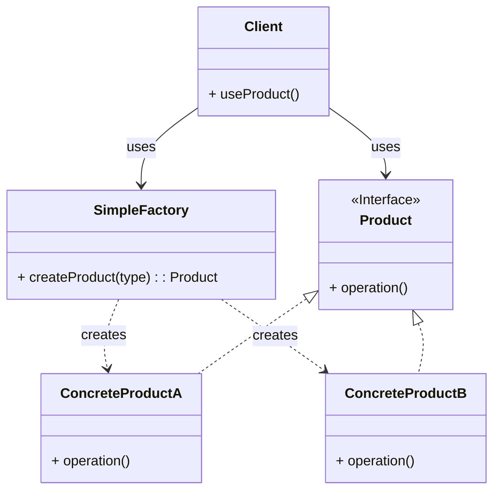
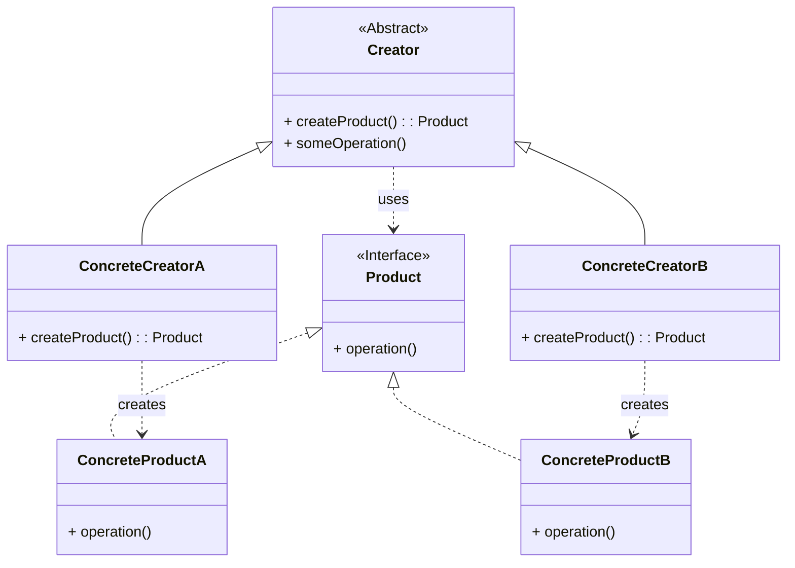

# Factory Patterns

This module demonstrates two related but distinct creational design patterns: Simple Factory and Factory Method.

## Simple Factory Pattern

### Intent
Encapsulate object creation logic in a single class that provides a static or instance method to create and return objects based on input parameters.

### Structure (MermaidJS)



### Explanation
* **SimpleFactory**: Provides a method that handles object creation logic based on parameters
* **Product**: Defines the interface for objects created by the factory
* **ConcreteProduct**: Implements the Product interface
* **Client**: Uses the factory to create products without specifying their concrete classes

## Factory Method Pattern

### Intent
Define an interface for creating objects in a superclass, but allow subclasses to alter the type of objects that will be created.

### Structure (MermaidJS)



### Explanation
* **Creator**: Declares the factory method that returns a Product object
* **ConcreteCreator**: Overrides the factory method to create and return a ConcreteProduct
* **Product**: Defines the interface for objects created by the factory method
* **ConcreteProduct**: Implements the Product interface

## Key Differences

| Aspect         | Simple Factory                      | Factory Method                                   |
|----------------|-------------------------------------|--------------------------------------------------|
| Structure      | Single class                        | Class hierarchy                                  |
| Extension      | Requires modifying factory code     | Create new creator subclasses                    |
| Responsibility | Knows how to create all products    | Each creator knows how to create one product     |
| Decision Logic | Typically uses switch/if statements | Uses polymorphism                                |
| Usage          | When product types are fixed        | When product creation logic should be extensible |

## Implementation Examples

### Common Elements

Both patterns use a common `Vehicle` interface and concrete implementations:

* `Vehicle.java` - The common product interface
* `Car.java`, `Bike.java`, `Airplane.java` - Concrete product implementations

### Simple Factory Implementation

* `VehicleType.java` - Enumeration of available vehicle types
* `SimpleVehicleFactory.java` - Factory that creates vehicles based on type

Example:
```java
SimpleVehicleFactory factory = new SimpleVehicleFactory();
Vehicle car = factory.newVehicle(VehicleType.CAR);
```

### Factory Method Implementation

* `VehicleCreator.java` - Abstract creator with factory method
* `CarCreator.java`, `BikeCreator.java`, `AirplaneCreator.java` - Concrete creators

Example:
```java
VehicleCreator creator = new CarCreator();
Vehicle car = creator.createVehicle();
String sound = creator.getVehicleSound();
```

## When to Use Each Pattern

**Use Simple Factory when:**
* You have a limited, well-defined set of product types
* You want to centralize creation logic in one place
* Product creation is relatively simple

**Use Factory Method when:**
* You don't know what types of objects your code will need to create
* You want to allow for extension without modifying existing code
* You want to delegate responsibility to subclasses
* You're working within a class hierarchy

## Tests

See `TestFactoryPattern.java` for examples of how to use both patterns.