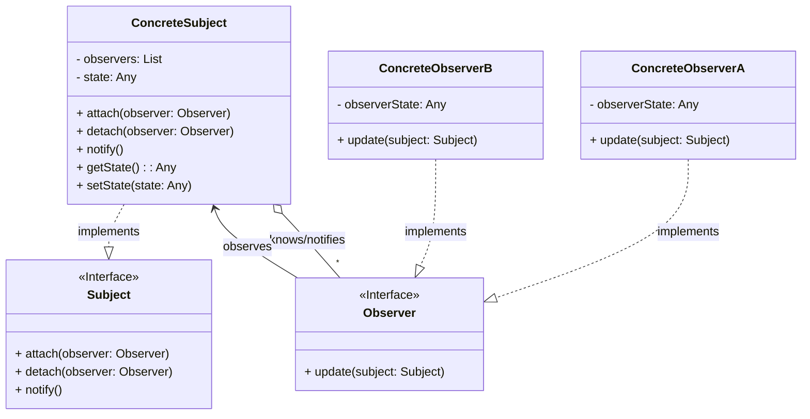

# Observable Pattern Recipe

The Observable pattern (also known as Observer or Publish-Subscribe) is a behavioral design pattern where an object, called the subject (or observable), maintains a list of its dependents, called observers, and notifies them automatically of any state changes, usually by calling one of their methods.

## Intent

Define a one-to-many dependency between objects so that when one object changes state, all its dependents are notified and updated automatically.

## Structure (MermaidJS)

## Explanation

*   **Subject (Observable)**: Knows its observers. Any number of `Observer` objects may observe a subject. Provides an interface for attaching and detaching `Observer` objects.
*   **ConcreteSubject**: Stores state of interest to `ConcreteObserver` objects. Sends a notification to its observers when its state changes.
*   **Observer**: Defines an updating interface for objects that should be notified of changes in a subject. All concrete observers implement the `Observer` interface.
*   **ConcreteObserver**: Maintains a reference to a `ConcreteSubject` object. Stores state that should stay consistent with the subject's state. Implements the `Observer` updating interface to keep its state consistent with the subject's.

When the state of the `ConcreteSubject` changes, it calls `notify()`, which iterates through its list of `Observer`s and calls their `update()` method. The `Observer` can then query the `Subject` for the updated state.

This pattern promotes loose coupling between the subject and its observers. The subject only knows about the abstract `Observer` interface, not the concrete implementations. New observers can be added without modifying the subject.

*(Note: Java provides `java.util.Observer` and `java.util.Observable`, but they are generally considered deprecated in modern Java due to limitations. Libraries like RxJava, Project Reactor, or `java.beans.PropertyChangeListener` offer more robust implementations of the observer concept.)* 