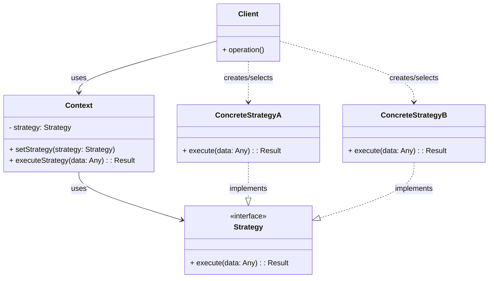

# Strategy Pattern Recipe

The Strategy pattern is a behavioral design pattern that enables selecting an algorithm's behavior at runtime. Instead of implementing a single algorithm directly, code receives runtime instructions as to which in a family of algorithms to use.

## Intent

Define a family of algorithms, encapsulate each one, and make them interchangeable. Strategy lets the algorithm vary independently from clients that use it.

## Structure (MermaidJS)

## Explanation

*   **Strategy**: Declares an interface common to all supported algorithms. `Context` uses this interface to call the algorithm defined by a `ConcreteStrategy`.
*   **ConcreteStrategy**: Implements the algorithm using the `Strategy` interface. There can be multiple concrete strategies.
*   **Context**:
    *   Is configured with a `ConcreteStrategy` object.
    *   Maintains a reference to a `Strategy` object.
    *   May define an interface that lets `Strategy` access its data.
    *   Calls the algorithm through the `Strategy` interface.
*   **Client**: Creates a specific `ConcreteStrategy` object and passes it to the `Context`. The client is aware of different strategies and chooses one.

This pattern allows you to swap algorithms used inside an object at runtime. It separates the algorithm implementation from the object that uses it, promoting flexibility and adherence to the Open/Closed Principle (classes should be open for extension but closed for modification).

## Usage

See module for examples:
- [Animal.java](src/main/java/Animal.java)
- [BarkStrategy.java](src/main/java/BarkStrategy.java)
- [MeowStrategy.java](src/main/java/MeowStrategy.java)
- [SoundStrategy.java](src/main/java/SoundStrategy.java)
- [TestStrategyPattern.java](src/test/java/TestStrategyPattern.java)